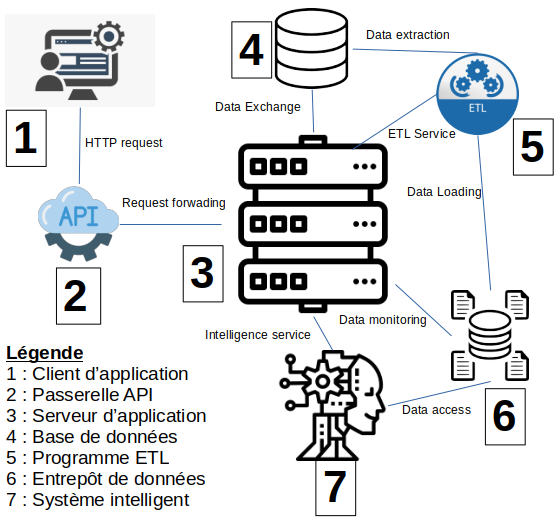

# LoGA-Project
LoGA - Libreoffice Garage Apps [infos](https://github.com/rocdane/loga-project)

## Description
LoGA est un projet informatique qui a pour objectif d'aider les garagistes dans la gestion des maintenances. C'est un projet d'étude qui va au délà de son cadre initial. Le produit final sera utile pout tous les garagistes désirant améliorer leur méthode de travail.[A propos](https://github.com/rocdane/loga-project)



## Fonctionnalités

### Basic
1. Gestion informatisée des informations clients
2. Gestion informatisée des informations de maintenance
3. Monitoring et reporting des informations de gestion

### Les plus
4. Service intelligent d'aide au diagnostic
5. Constitution d'un stock virtuel de pièces de rechanges
6. Service intelligent d'aide à la commande des pièces de rechanges
7. Gestion informatisée de l'approvisionnement en pièce de rechanges
8. Gestion informatisée des ressources humaines
9. Gestion informatisée des ressources matérielles
10. Gestion informatisée du flux financier
11. Elaboration du bilan comptable

```json
{
  "title":"LoGA-Project",
  "description":"LoGA est un projet informatique qui a pour objectif d'aider les garagistes dans la gestion des maintenances",
  "features":[
    "customer_resource_management":"Gestion informatisée des ressources clients",
    "maintenance_resource_management":"Gestion informatisée des ressources maintenances",
    "resource_monitoring_management":"Gestion informatisée des ressources statistiques"
  ]
}
```

## Concepts

```json
{
  "user":{
  	"username",
  	"password",
  	"role"
  },
  "profile":{
  	"name",
  	"surname",
  	"legacy",
	"email",
	"phone",
	"address",
	"user",
	"hireAt",
	"fireAt"
  },
  "maintenance":{
  	"dossier":{
	  	"reference",
	  	"createdAt",
	  	"customer":{
	   		"name",
	    		"contact",
	    		"address",
	    		"legacy"
	  	},
	  	"automobile":{
		  	"vin",
		  	"make",
		  	"model",
		  	"number",
		  	"trim",
		  	"unit"
	  	}
  	},
  	"diagnosis":{
	  	"reference",
	  	"description",
	  	"factors":[
	  		"entity",
	  		"dysfunction",
	  		"maintenance"
	  	]
	},
  	"repair":{
	  	"reference",
	  	"description",
	  	"tasks":[
	  		"designation",
	  		"description",
	  		"duration",
	  		"cost"
	  	],
	  	"spares":[
	  		"designation",
	  		"description",
	  		"quantity",
	  		"price",
	  		"amount"
	  	]
	}
  }
}
```

## Conception
### Comportements


### Structures


### Composants

### Déploiement


## Résultats
### Ontologie d'application


### Interfaces


### Rapport


## Datas


